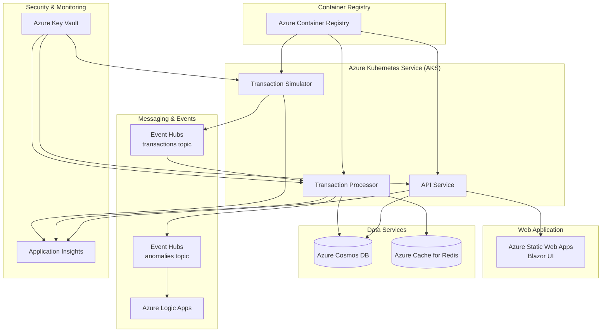
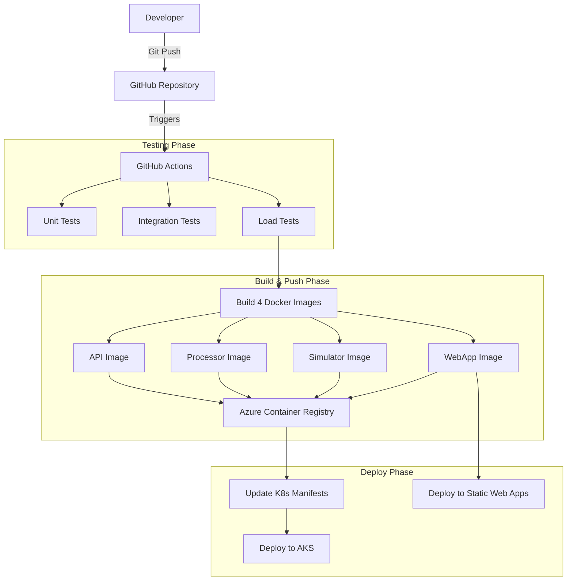
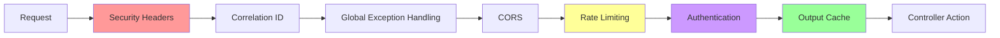

# Real-Time Financial Transactions Monitoring System

A complete, cloud-native application for real-time financial transaction monitoring and anomaly detection. Built with .NET 8, Azure services, and modern DevOps practices.

## Quick Overview

This system ingests, processes, and monitors financial transactions in real-time using an event-driven architecture. It automatically detects anomalous transactions, sends notifications, and provides interactive dashboards for monitoring.

**[Live Dashboard Screenshot](#dashboard-preview)** • **[Complete Documentation](docs/)** • **[Quick Start](#quick-start)**

## Architecture Overview

Event-driven microservices architecture with real-time processing and cloud-native deployment.

### System Components


### Azure Infrastructure

Production infrastructure showing all Azure services and their relationships:



### CI/CD Pipeline

Automated deployment pipeline with comprehensive testing and multi-stage deployment:



**Detailed Architecture**: [System Overview](docs/overview.md) • [Transaction Processor](docs/transaction-processor.md) • [API Documentation](docs/api-documentation.md)

### Dashboard Preview

Real-time monitoring dashboard built with Blazor WebAssembly:


## Key Features

### Real-Time Processing
- **Event-Driven Architecture**: High-throughput message processing with Azure Event Hubs/Kafka
- **Intelligent Anomaly Detection**: Stateful detection using historical account patterns
- **Instant Notifications**: Automated alerts via Azure Logic Apps

### Security & Monitoring
- **Azure AD Workload Identity**: Passwordless authentication
- **API Key Authentication**: Secure REST API access
- **Application Insights**: Distributed tracing and monitoring
- **Azure Key Vault**: Centralized secret management

### Performance & Scalability
- **Auto-Scaling**: Horizontal Pod Autoscaler (HPA) and Cluster Autoscaler
- **Response Caching**: ASP.NET Core OutputCache for optimal performance
- **Load Balancing**: NGINX Ingress with SSL/TLS termination

### DevOps & Deployment
- **Infrastructure as Code**: Complete Terraform automation
- **CI/CD Pipeline**: GitHub Actions with automated testing and deployment
- **Multi-Environment**: Separate local development and cloud production setups

**Complete Feature List**: [System Overview](docs/overview.md)

## Intelligent Transaction Generation

Professional-grade synthetic data generation for testing and development.

### Smart User Personas
- **7 User Types**: Students, Young Professionals, Families, Retirees, High Net Worth, Small Business, Freelancers
- **Behavioral Patterns**: Realistic spending habits, time preferences, and geographic distribution
- **50+ US Cities**: Authentic location data with travel probability modeling

### Advanced Features
- **Temporal Intelligence**: Business hours, weekend patterns, timezone awareness
- **Amount Distribution**: Category-specific ranges with normal distribution curves
- **Anomaly Injection**: Controlled suspicious patterns for testing

**Technical Details**: [Transaction Simulator Documentation](docs/simulator-docs.md)

## Technology Stack

### Core Technologies
- **.NET 8**: C# 12, ASP.NET Core Web API, Worker Services, Blazor WebAssembly
- **Azure Cloud**: AKS, Event Hubs, Cosmos DB, Static Web Apps, Key Vault, Application Insights
- **Infrastructure**: Docker, Kubernetes, Terraform, GitHub Actions

### Development Tools
- **Testing**: xUnit, TestContainers, NBomber load testing
- **Security**: FluentValidation, rate limiting, CORS, security headers
- **Monitoring**: Application Insights, structured logging, health checks

### API Request Pipeline

Modern API middleware stack with security, caching, and observability:



**Complete Stack Details**: [Setup Documentation](docs/setup-docs.md)

## Quick Start

### Local Development
```bash
# Clone repository
git clone <repository-url>
cd RealTimeFinancialMonitoring

# Start all services with Docker
cp .env.example .env
docker-compose up -d

# Start Blazor frontend
cd src/FinancialMonitoring.WebApp && dotnet run
```

### Cloud Deployment
```bash
# Complete Azure deployment
make deploy

# Or step-by-step
make infra        # Deploy infrastructure
make apps         # Deploy applications
make frontend     # Deploy frontend
```

**Detailed Setup**: [Setup Documentation](docs/setup-docs.md) • [CI/CD Pipeline](docs/ci-cd-pipeline.md)

## Project Structure

```
├── docs/                    # Complete Documentation
│   ├── setup-docs.md          # Setup & deployment guide
│   ├── api-documentation.md   # REST API reference
│   ├── transaction-processor.md # Core processing engine docs
│   └── overview.md            # System architecture
├── src/                     # .NET Applications
│   ├── FinancialMonitoring.Api/        # REST API service
│   ├── TransactionProcessor/           # Event processing engine
│   ├── TransactionSimulator/           # Data generation service
│   └── FinancialMonitoring.WebApp/     # Blazor dashboard
├── infra/                   # Terraform Infrastructure
├── k8s-manifest/           # Kubernetes Deployments
├── scripts/                # Deployment Automation
└── tests/                  # Comprehensive Test Suite
```

## Testing

Comprehensive testing strategy with unit, integration, and load tests.

```bash
# Build test environment
docker compose -f docker-compose.test.yml build

# Run unit tests only
dotnet test --configuration Release --logger "console;verbosity=minimal"

# Run full test suite (unit, integration, load)
./scripts/generalUtils/run-tests.sh

# Run specific test types
docker compose -f docker-compose.test.yml run --rm integration-tests
docker compose -f docker-compose.test.yml run --rm load-tests
```

## Documentation

| Topic | Description | Link |
|-------|-------------|------|
| **Architecture** | System design and data flow | [overview.md](docs/overview.md) |
| **Setup Guide** | Local dev and cloud deployment | [setup-docs.md](docs/setup-docs.md) |
| **CI/CD Pipeline** | Automated build and deployment | [ci-cd-pipeline.md](docs/ci-cd-pipeline.md) |
| **API Reference** | REST API endpoints and examples | [api-documentation.md](docs/api-documentation.md) |
| **Transaction Processor** | Core processing engine details | [transaction-processor.md](docs/transaction-processor.md) |
| **Transaction Simulator** | Data generation engine | [simulator-docs.md](docs/simulator-docs.md) |

## Contributing

This project uses AI as a development mentor and teaching tool. See [AI Usage Documentation](docs/ai-usage.md) for the development philosophy and [CLAUDE.md](CLAUDE.md) for AI configuration.

## Future Enhancements

- **OAuth 2.0/JWT Authentication**: Enhanced API security with standard authentication flows
- **Multi-Environment CI/CD**: Staging and production pipelines with manual approvals
- **Advanced Dashboards**: Custom Azure dashboards for system health visualization
- **Advanced Anomaly Detection**: Enhanced rule-based detection with multiple algorithms

---

**Star this repo if you find it useful!** • **Report issues** • **Suggest enhancements**
