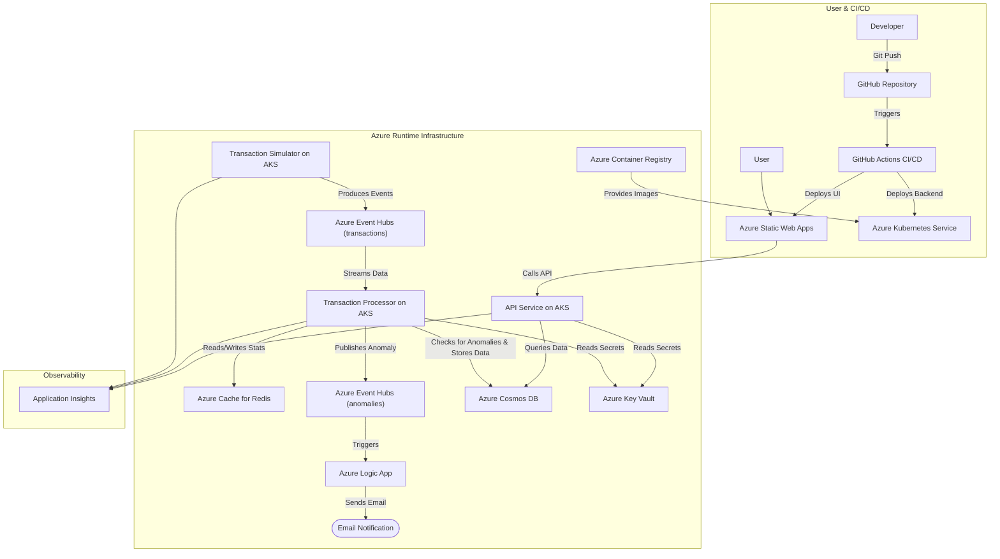

# Real-Time Financial Transactions Monitoring System

This project is a complete, cloud-native application designed to ingest, process, and monitor financial transaction data in real-time. It leverages a modern microservices-style architecture deployed on Azure Kubernetes Service (AKS) and a Blazor WebAssembly front-end hosted on Azure Static Web Apps.

The primary goal is to identify and flag anomalous transactions, provide a queryable API, send notifications, and visualize the entire process on an interactive web dashboard. The entire infrastructure is managed as code using Terraform, with a full CI/CD pipeline for automated builds and deployments.

## Architecture

The system follows an event-driven architecture, ensuring scalability and resilience.



## Key Features

* **Interactive Web UI:** A dashboard built with **Blazor WebAssembly** and hosted on **Azure Static Web Apps** provides a live view of transactions, KPIs, and charts.
* **Real-Time Event Ingestion:** Uses Azure Event Hubs to handle high-throughput data streams.
* **Asynchronous Processing:** A .NET Worker Service consumes events and processes them independently.
* **Stateful Anomaly Detection:** An extensible system for flagging suspicious transactions. Uses **Azure Cache for Redis** to maintain real-time account statistics for more intelligent rule-based detection.
* **Serverless Notifications:** Uses **Azure Logic Apps** to send email alerts when an anomaly is detected.
* **Scalable NoSQL Persistence:** Uses Azure Cosmos DB (SQL API, Free Tier) for efficient storage.
* **Cloud-Native Deployment:** The entire application stack is containerized with Docker and orchestrated by **Azure Kubernetes Service (AKS)** with health probes and resource limits.
* **Automated Scaling:** The API autoscales using the Horizontal Pod Autoscaler (HPA), and the cluster itself scales with the Cluster Autoscaler.
* **Infrastructure as Code (IaC):** All Azure resources are defined and managed declaratively using **Terraform**.
* **End-to-End CI/CD:** A **GitHub Actions** workflow automates the entire process from commit to cloud deployment for both the backend and front-end.
* **Secure Configuration & Identity:**
    * Secrets are stored securely in **Azure Key Vault**.
    * The API is secured using **API Key authentication**.
    * Services running in AKS use **Azure AD Workload Identity** for a modern, secure, and passwordless authentication to Key Vault.
* **Centralized Observability:** All services are instrumented with **Application Insights** for distributed tracing, logging, and performance monitoring.

## Technology Stack

* **Languages & Frameworks:** C# 12, .NET 8, ASP.NET Core (Web API), Worker Service, Blazor WebAssembly, xUnit
* **Azure Cloud Services:**
    * Azure Kubernetes Service (AKS)
    * Azure Container Registry (ACR)
    * Azure Static Web Apps
    * Azure Cosmos DB (SQL API, Free Tier)
    * Azure Event Hubs (Basic Tier)
    * Azure Cache for Redis
    * Azure Logic Apps
    * Azure Key Vault
    * Azure Active Directory (Workload Identity)
    * Application Insights & Log Analytics Workspace
    * Azure Storage (for Terraform remote state)
* **Tools & Concepts:** Docker, Kubernetes (Manifests with Kustomize), Terraform, GitHub Actions, Git, REST API, Dependency Injection

## Project Structure

```
.
├── .github/workflows/      # GitHub Actions CI/CD pipeline definitions
├── infra/                  # Terraform files for all Azure infrastructure
├── k8s-manifests/          # Kubernetes manifest files (Deployments, Services, etc.)
├── setup/                  # Contains bootstrap and app configuration scripts
│   ├── bootstrap.sh
│   └── setup_app_config.sh
├── src/                    # .NET source code
│   ├── FinancialMonitoring.Abstractions/
│   ├── FinancialMonitoring.Api/
│   ├── FinancialMonitoring.Models/
│   ├── FinancialMonitoring.WebApp/
│   ├── TransactionProcessor/
│   └── TransactionSimulator/
└── tests/                  # xUnit test projects
    ├── FinancialMonitoring.Api.Tests/
    ├── FinancialMonitoring.IntegrationTests/
    ├── FinancialMonitoring.LoadTests/
    ├── FinancialMonitoring.Models.Tests/
    ├── TransactionProcessor.Tests/
    └── TransactionSimulator.Tests/
```

## Testing

This project includes a comprehensive testing strategy to ensure code quality, correctness, and performance.

### Test Types

*   **Unit Tests**: Located in `tests/`, these cover individual components and business logic.
*   **Integration Tests**: Found in `tests/FinancialMonitoring.IntegrationTests`, these validate the end-to-end transaction flow using real services spun up with TestContainers.
*   **Load Tests**: The `tests/FinancialMonitoring.LoadTests` project uses NBomber to stress-test the API and ensure it meets performance benchmarks.

### Running Tests

A convenience script is provided to run all tests in the correct order. This script handles setting up and tearing down the necessary Docker containers.

```bash
./run-tests.sh
```

For more detailed instructions on running tests individually or understanding the test environment, please refer to the `docker-compose.test.yml` and the respective test project folders.

## Manual Deployment Guide

This guide outlines the streamlined, multi-stage deployment process for the Real-Time Financial Monitoring application. The workflow is orchestrated through a series of shell scripts that handle infrastructure provisioning, application configuration, and Kubernetes deployment, ensuring a repeatable and automated setup.

### Prerequisites

* An active Azure Subscription.
* [Azure CLI](https://docs.microsoft.com/en-us/cli/azure/install-azure-cli)
* [Terraform CLI](https://www.terraform.io/downloads.html)
* [kubectl](https://kubernetes.io/docs/tasks/tools/install-kubectl/)
* [jq](https://stedolan.github.io/jq/download/) (a command-line JSON processor)
* Docker Desktop (or Docker Engine)

### Deployment Workflow Overview

#### Phase 1: Infrastructure Bootstrapping (`bootstrap.sh`)

The foundation of our environment is managed declaratively with Terraform. The `bootstrap.sh` script handles the prerequisite setup required to run `terraform apply` successfully.

Its primary responsibilities include:
*   Validating the presence of required environment variables.
*   Authenticating with Azure via the Azure CLI.
*   Idempotently ensuring the target Azure subscription and resource group exist.
*   Provisioning a dedicated Service Principal with the necessary permissions for Terraform to manage resources.
*   Generating a sourceable file (`.env`) containing the Service Principal credentials, which configures the local environment for subsequent Terraform operations.

Once this script completes, the environment is fully prepared for infrastructure provisioning via `terraform apply`.

#### Phase 2: Application Configuration (`setup_app_config.sh`)

To decouple sensitive information from our infrastructure code, this script handles the post-provisioning configuration. After Terraform has created the Azure resources, `setup_app_config.sh` is run.

It programmatically populates the Azure Key Vault with dynamic, environment-specific values (e.g., Cosmos DB connection strings, Event Hub endpoints) that are outputs from the Terraform state. This ensures our application services can securely access the resources they depend on without hardcoding secrets.

#### Phase 3: Artifact Management (`build-and-push-to-acr.sh`)

This script manages the lifecycle of our application's container images. It builds the Docker images for the three core backend services, tags them as `latest`, and pushes them to our private Azure Container Registry (ACR). This makes the deployable artifacts available to the AKS cluster.

#### Phase 4: Kubernetes Deployment

With the infrastructure provisioned, secrets populated, and images published, the final step is to deploy the application to the AKS cluster.

1.  **Establish Cluster Context:** First, we link `kubectl` to our AKS cluster. The following command fetches the cluster's access credentials from Azure and merges them into the local `kubeconfig` file (`~/.kube/config`), which is the standard client configuration mechanism for `kubectl`.

    ```bash
    az aks get-credentials --resource-group <your-resource-group-name> --name <your-aks-cluster-name>
    ```

2.  **Deploy Application Manifests:** With the context established, we deploy the application stack using Kustomize, which allows for streamlined management of our Kubernetes manifests.

    ```bash
    kubectl apply -k k8s-manifest/
    ```

This command directs the cluster to apply all resources defined in the `k8s-manifest/` directory, pulling the specified images from ACR and launching the application services, ingress controllers, and autoscalers as defined.

## Future Enhancements

* **Advanced API Security:** Enhance the current API Key authentication with a standard OAuth 2.0 / JWT-based flow for user-level access.
* **Advanced CI/CD:** Implement multi-stage pipelines for deploying to `staging` and `production` environments with manual approvals.
* **Deepen Observability:** Create custom Azure Dashboards to visualize system health and performance metrics from Application Insights.
