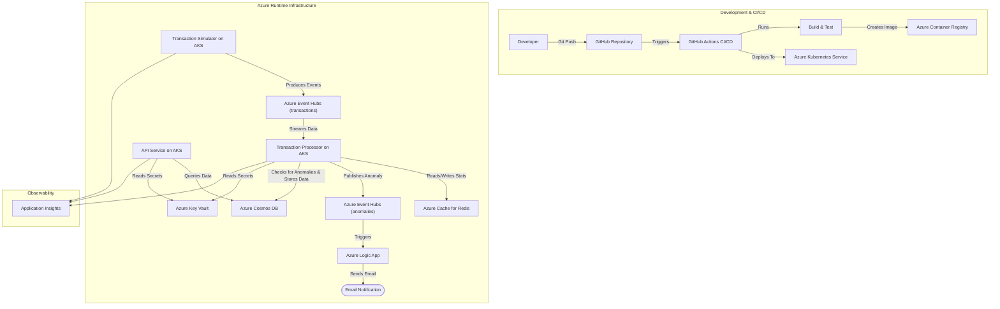

# Real-Time Financial Transactions Monitoring System

This project is a complete, cloud-native backend system designed to ingest, process, and monitor financial transaction data in real-time. It leverages a modern microservices-style architecture deployed on Azure Kubernetes Service (AKS), with a full CI/CD pipeline for automated builds, testing, and deployment.

The primary goal is to identify and flag anomalous transactions (e.g., high-value transfers), provide a queryable API for the results, and send notifications when an anomaly is detected. The entire infrastructure is managed as code using Terraform.

## Architecture

The system follows an event-driven architecture, ensuring scalability and resilience.



## Key Features

* **Real-Time Event Ingestion:** Uses Azure Event Hubs to handle high-throughput data streams.
* **Asynchronous Processing:** A .NET Worker Service consumes events and processes them independently.
* **Stateful Anomaly Detection:** An extensible system for flagging suspicious transactions. Uses **Azure Cache for Redis** to maintain real-time account statistics for more intelligent rule-based detection (e.g., transaction amount deviates significantly from the account's average).
* **Serverless Notifications:** Uses **Azure Logic Apps** to send email alerts when an anomaly is detected.
* **Scalable NoSQL Persistence:** Uses Azure Cosmos DB (SQL API, Free Tier) for efficient storage.
* **Cloud-Native Deployment:** The entire application stack is containerized with Docker and orchestrated by **Azure Kubernetes Service (AKS)** with health probes and resource limits.
* **Automated Scaling:** The API autoscales using the Horizontal Pod Autoscaler (HPA), and the cluster itself scales with the Cluster Autoscaler.
* **Infrastructure as Code (IaC):** All Azure resources are defined and managed declaratively using **Terraform**.
* **End-to-End CI/CD:** A **GitHub Actions** workflow automates the entire process from commit to cloud deployment.
* **Secure Configuration Management:** Secrets are stored securely in **Azure Key Vault**.
* **Centralized Observability:** All services are instrumented with **Application Insights** for distributed tracing, logging, and performance monitoring.

## Technology Stack

* **Languages & Frameworks:** C# 12, .NET 8, ASP.NET Core (Web API), Worker Service, xUnit
* **Azure Cloud Services:**
    * Azure Kubernetes Service (AKS)
    * Azure Container Registry (ACR)
    * Azure Cosmos DB (SQL API, Free Tier)
    * Azure Event Hubs (Basic Tier)
    * Azure Cache for Redis
    * Azure Logic Apps
    * Azure Key Vault
    * Application Insights & Log Analytics Workspace
    * Azure Storage (for Terraform remote state)
* **Tools & Concepts:** Docker, Kubernetes (Manifests with Kustomize), Terraform, GitHub Actions, Git, REST API, Dependency Injection

## Project Structure

```
.
├── .github/workflows/      # GitHub Actions CI/CD pipeline definitions
├── infra/                  # Terraform files for all Azure infrastructure
├── k8s-manifests/          # Kubernetes manifest files (Deployments, Services, etc.)
├── setup/                  # Contains bootstrap and app configuration scripts
│   ├── bootstrap.sh
│   └── setup_app_config.sh
├── src/                    # .NET source code
│   ├── FinancialMonitoring.Abstractions/
│   ├── FinancialMonitoring.Api/
│   ├── FinancialMonitoring.Models/
│   ├── TransactionProcessor/
│   └── TransactionSimulator/
└── tests/                  # xUnit test projects
    ├── FinancialMonitoring.Api.Tests/
    └── FinancialMonitoring.Models.Tests/
```

## Getting Started: Cloud Deployment Guide

This guide outlines the end-to-end process to provision the Azure infrastructure and deploy the application from a fresh repository clone.

### Prerequisites

* An active Azure Subscription.
* [Azure CLI](https://docs.microsoft.com/en-us/cli/azure/install-azure-cli)
* [Terraform CLI](https://www.terraform.io/downloads.html)
* [kubectl](https://kubernetes.io/docs/tasks/tools/install-kubectl/)
* [jq](https://stedolan.github.io/jq/download/) (a command-line JSON processor)
* Docker Desktop (or Docker Engine)

### Deployment Steps

The setup is automated via a series of scripts. Follow these steps in order from the project root directory.

**1. Run the Bootstrap Script**

This script creates the foundational Azure resources (Resource Group, Terraform State Storage) and the primary Service Principal used by Terraform.

* First, open `setup/bootstrap.sh` and update the variables in the `VARIABLES TO EDIT` block with your Azure Subscription ID and desired resource names/locations.
* Then run the script:
    ```bash
    ./setup/bootstrap.sh
    ```
* This script will generate helper files and print detailed instructions for the next steps. **Follow the instructions output by the script carefully.**

**2. Follow the Instructions from `bootstrap.sh`**

The instructions output by the `bootstrap.sh` script will guide you through the next phase. This involves:

* **Provisioning Infrastructure with Terraform:** You will `source` an environment file to authenticate as the Terraform SP, then run `terraform init` and `terraform apply` to create the Key Vault, AKS cluster, ACR, Cosmos DB, Event Hubs, and Redis Cache.
* **Configuring the Application:** After Terraform is complete, you will run the second script, `./setup/setup_app_config.sh`. This creates the application's dedicated Service Principal, populates Key Vault with all necessary secrets, and generates the final `.env` file for the application runtime.
* **Building and Pushing Images:** The instructions will then guide you to run `./build-and-push-local.sh` (or a similar script) to build your production Docker images and push them to your new Azure Container Registry.
* **Deploying to AKS:** Finally, the instructions will provide the `az aks get-credentials` and `kubectl apply -k .` commands to deploy the application to your Kubernetes cluster.

By following the sequence of scripts and the instructions they provide, you will have a complete cloud deployment.

## Future Enhancements

* **API Security:** The API is currently secured by a simple API Key. This could be enhanced with a standard OAuth 2.0 / JWT-based flow.
* **Passwordless Identity:** Upgrade from a Service Principal with a secret to using Azure AD Workload Identity for the most secure, passwordless access to Key Vault from AKS.
* **Advanced CI/CD:** Implement multi-stage pipelines for deploying to `staging` and `production` environments with manual approvals.
