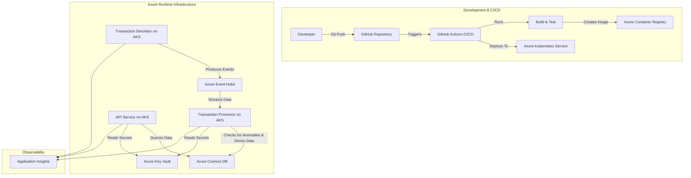

# Real-Time Financial Transactions Monitoring System

This project is a complete, cloud-native backend system designed to ingest, process, and monitor financial transaction data in real-time. It leverages a modern microservices-style architecture deployed on Azure Kubernetes Service (AKS), with a full CI/CD pipeline for automated builds, testing, and deployment.

The primary goal is to identify and flag anomalous transactions (e.g., high-value transfers) and provide a queryable API for the results. The entire infrastructure is managed as code using Terraform.

## Architecture

The system follows an event-driven architecture, ensuring scalability and resilience.



## Key Features

* **Real-Time Event Ingestion:** Uses Azure Event Hubs to handle high-throughput data streams.
* **Asynchronous Processing:** A .NET Worker Service consumes events and processes them independently, ensuring the ingestion endpoint is never blocked.
* **Rule-Based Anomaly Detection:** A simple but extensible system for flagging suspicious transactions.
* **Scalable NoSQL Persistence:** Uses Azure Cosmos DB (SQL API, Free Tier) for efficient storage and querying of transaction data.
* **Cloud-Native Deployment:** The entire application stack is containerized with Docker and orchestrated by Azure Kubernetes Service (AKS).
* **Infrastructure as Code (IaC):** All Azure resources (AKS, ACR, Cosmos DB, Key Vault, Event Hubs, etc.) are defined and managed declaratively using **Terraform**.
* **End-to-End CI/CD:** A **GitHub Actions** workflow automates the entire process from commit to cloud deployment.
* **Secure Configuration Management:** All secrets (connection strings, keys) are stored securely in **Azure Key Vault**.
* **Centralized Observability:** All services are instrumented with **Application Insights** for distributed tracing, logging, and performance monitoring.

## Technology Stack

* **Languages & Frameworks:** C# 12, .NET 8, ASP.NET Core (Web API), Worker Service, xUnit
* **Azure Cloud Services:**
    * Azure Kubernetes Service (AKS)
    * Azure Container Registry (ACR)
    * Azure Cosmos DB (SQL API, Free Tier)
    * Azure Event Hubs (Basic Tier)
    * Azure Key Vault
    * Application Insights & Log Analytics Workspace
    * Azure Storage (for Terraform remote state)
* **Tools & Concepts:** Docker, Kubernetes (Manifests with Kustomize), Terraform, GitHub Actions, Git, REST API, Dependency Injection

## Project Structure

```
.
├── .github/workflows/      # GitHub Actions CI/CD pipeline definitions
├── infra/                  # Terraform files for all Azure infrastructure
├── k8s-manifests/          # Kubernetes manifest files (Deployments, Services, etc.)
├── setup/                  # Contains bootstrap and app configuration scripts
│   ├── bootstrap.sh
│   └── setup_app_config.sh
├── src/                    # .NET source code
│   ├── FinancialMonitoring.Abstractions/
│   ├── FinancialMonitoring.Api/
│   ├── FinancialMonitoring.Models/
│   ├── TransactionProcessor/
│   └── TransactionSimulator/
└── tests/                  # xUnit test projects
    ├── FinancialMonitoring.Api.Tests/
    └── FinancialMonitoring.Models.Tests/
```

## Getting Started: Deployment Guide

This guide outlines the steps to provision the necessary Azure infrastructure and deploy the application from a fresh clone.

### Prerequisites

* An active Azure Subscription.
* Azure CLI
* Terraform CLI
* kubectl
* jq (a command-line JSON processor)

### Part 1: Bootstrap Azure Prerequisites

The `setup/bootstrap.sh` script creates foundational resources needed for Terraform and the application's identity. This includes a Resource Group, a Storage Account for Terraform's remote state, and a powerful Service Principal (SP) for Terraform to use.

1.  **Log in to Azure CLI:** `az login`
2.  **Set Your Subscription:** `az account set --subscription "<Your-Subscription-ID>"`
3.  **Edit `setup/bootstrap.sh`:** Open the script and update the variables in the `VARIABLES TO EDIT` block.
4.  **Run the Script** from the project root:
    ```bash
    ./setup/bootstrap.sh
    ```
    This script will generate `infra/backend.tf` and `.terraform.env`.

### Part 2: Provision Infrastructure with Terraform

Now you will use Terraform (authenticating as the SP created above) to deploy the application's infrastructure.

1.  **Source the Terraform Environment Variables:**
    ```bash
    source ./.terraform.env
    ```
2.  **Create an Application Identity and Terraform Variables:**
    The `setup/setup_app_config.sh` script automates creating a second, low-privilege SP for your application and creating the `terraform.tfvars` file that Terraform needs. Run it from the project root:
    ```bash
    ./setup/setup_app_config.sh
    ```
3.  **Initialize and Apply Terraform:**
    Navigate to the Terraform directory and run `init` and `apply`. This creates your Key Vault, AKS cluster, ACR, Cosmos DB, and Event Hubs.
    ```bash
    cd infra
    terraform init -upgrade
    terraform apply
    ```
    (Review the plan and type `yes` to approve).

### Part 3: Configure and Deploy the Application

1.  **Populate Key Vault:**
    The `setup/setup_app_config.sh` script will have already printed the `az keyvault secret set` commands you need to run. Execute those commands now as your own user (you may need to run `unset ARM_*` variables first).

2.  **Configure Local `.env` File:**
    The setup script will also have populated the main `.env` file in the project root with the credentials for your **Application SP** and your Key Vault URI. Ensure this file is in your `.gitignore`.

3.  **Deploy to AKS:**
    * Connect `kubectl` to your new cluster:
        ```bash
        az aks get-credentials --resource-group "<your-rg-name>" --name "<your-aks-cluster-name>" --overwrite-existing
        ```
    * Apply the Kubernetes manifests using Kustomize:
        ```bash
        cd ../k8s-manifests
        kubectl apply -k .
        ```

### Local Development

For local development, this project uses Docker Compose to run local equivalents of the cloud services (Kafka and the Cosmos DB Emulator).

1.  Ensure you have Docker Desktop installed and running.
2.  Create a `.env` file in the project root for your local Docker Compose setup. You do not need Azure credentials for this mode. Use `secrets.env` (created by the setup script) as a reference for the static values.
3.  Run Docker Compose from the project root:
    ```bash
    docker-compose up --build
    ```

### Future Enhancements

* **Production Hardening for Kubernetes:** Implement `resources` (requests/limits) and health probes (`livenessProbe`, `readinessProbe`) for all deployments.
* **API Security:** Add authentication and authorization (e.g., JWT-based) to the API endpoints.
* **Advanced Anomaly Detection:** Implement more sophisticated, stateful anomaly detection rules.
* **Serverless Notifications:** Use an Azure Function triggered by an "Anomaly Detected" event to send notifications.
