# Real-Time Financial Transactions Monitoring System

This project is a complete, cloud-native application designed to ingest, process, and monitor financial transaction data in real-time. It leverages a modern microservices-style architecture deployed on Azure Kubernetes Service (AKS) and a Blazor WebAssembly front-end hosted on Azure Static Web Apps.

The primary goal is to identify and flag anomalous transactions, provide a queryable API, send notifications, and visualize the entire process on an interactive web dashboard. The entire infrastructure is managed as code using Terraform, with a full CI/CD pipeline for automated builds and deployments.

## Architecture

The system follows an event-driven architecture, ensuring scalability and resilience. The architecture is presented through four focused diagrams that clearly separate different aspects of the system.

### CI/CD Pipeline

The automated deployment pipeline handles testing, building, and deployment of all components:

```mermaid
graph TD
    DEV[👨‍💻 Developer] -- Git Push --> REPO[📁 GitHub Repository]
    REPO -- Triggers --> ACTIONS[⚙️ GitHub Actions]
    
    subgraph "Testing Phase"
        ACTIONS --> UNIT[🧪 Unit Tests]
        ACTIONS --> INTEGRATION[🔗 Integration Tests]
        ACTIONS --> LOAD[⚡ Load Tests]
    end
    
    subgraph "Build & Push Phase"
        UNIT --> BUILD[🔨 Build 4 Docker Images]
        BUILD --> API_IMG[📦 API Image]
        BUILD --> PROC_IMG[📦 Processor Image]
        BUILD --> SIM_IMG[📦 Simulator Image]
        BUILD --> WEB_IMG[📦 WebApp Image]
        
        API_IMG --> ACR[🏪 Azure Container Registry]
        PROC_IMG --> ACR
        SIM_IMG --> ACR
        WEB_IMG --> ACR
    end
    
    subgraph "Deploy Phase"
        ACR --> K8S_UPDATE[📝 Update K8s Manifests]
        K8S_UPDATE --> AKS[☸️ Deploy to AKS]
        WEB_IMG --> SWA[🌐 Deploy to Static Web Apps]
    end
```



### Azure Infrastructure

All Azure services and their relationships in the cloud infrastructure:

```mermaid
graph TB
    subgraph "Compute & Container Services"
        AKS[☸️ Azure Kubernetes Service]
        ACR[🏪 Azure Container Registry]
        SWA[🌐 Azure Static Web Apps]
    end
    
    subgraph "Data & Messaging Services"
        COSMOS[(🌍 Azure Cosmos DB)]
        REDIS[(⚡ Azure Cache for Redis)]
        EH_TRANS[📨 Event Hubs<br/>transactions]
        EH_ANOM[📨 Event Hubs<br/>anomalies]
    end
    
    subgraph "Security & Monitoring"
        KV[🔐 Azure Key Vault]
        INSIGHTS[📊 Application Insights]
    end
    
    subgraph "Automation & Notifications"
        LOGIC[🔄 Azure Logic Apps]
        EMAIL[📧 Email Service]
    end
    
    ACR --> AKS
    AKS --> COSMOS
    AKS --> REDIS
    AKS --> EH_TRANS
    AKS --> EH_ANOM
    AKS --> KV
    AKS --> INSIGHTS
    EH_ANOM --> LOGIC
    LOGIC --> EMAIL
```



### Runtime Application Architecture

How the three main containerized services interact within the Kubernetes cluster:

```mermaid
graph LR
    subgraph "AKS Cluster"
        SIM[🎯 Transaction<br/>Simulator]
        PROC[⚙️ Transaction<br/>Processor]
        API[🔌 API<br/>Service]
    end
    
    subgraph "External Services"
        UI[💻 Blazor WebApp<br/>Static Web Apps]
        USER[👤 End User]
    end
    
    subgraph "Storage & Messaging"
        EH_TRANS[📨 Event Hubs<br/>transactions]
        EH_ANOM[📨 Event Hubs<br/>anomalies]
        COSMOS[(🌍 Cosmos DB)]
        REDIS[(⚡ Redis Cache)]
    end
    
    SIM --> EH_TRANS
    EH_TRANS --> PROC
    PROC --> COSMOS
    PROC --> REDIS
    PROC --> EH_ANOM
    API --> COSMOS
    USER --> UI
    UI --> API
```



### Transaction Data Flow

Step-by-step journey of a transaction through the complete system:

```mermaid
graph TD
    START([💰 Transaction Generated]) --> SIM[🎯 Transaction Simulator]
    SIM --> EH1[📨 Event Hubs<br/>transactions topic]
    EH1 --> PROC[⚙️ Transaction Processor]
    
    subgraph "Processing Logic"
        PROC --> REDIS{⚡ Check Redis<br/>for Account Stats}
        REDIS --> ANOMALY_CHECK{🔍 Anomaly<br/>Detection}
        ANOMALY_CHECK -->|Normal| STORE1[💾 Store in Cosmos DB]
        ANOMALY_CHECK -->|Suspicious| STORE2[💾 Store in Cosmos DB<br/>+ Flag as Anomaly]
        STORE2 --> EH2[📨 Event Hubs<br/>anomalies topic]
        EH2 --> LOGIC[🔄 Logic Apps]
        LOGIC --> EMAIL[📧 Send Alert Email]
    end
    
    STORE1 --> DB[(🌍 Cosmos DB<br/>Transactions)]
    DB --> API[🔌 API Service]
    API --> UI[💻 Blazor WebApp]
    UI --> USER[👤 User Dashboard]
    
    style ANOMALY_CHECK fill:#ff9999
    style EMAIL fill:#ffcc99
```



## Key Features

* **Interactive Web UI:** A dashboard built with **Blazor WebAssembly** and hosted on **Azure Static Web Apps** provides a live view of transactions, KPIs, and charts.
* **Real-Time Event Ingestion:** Uses Azure Event Hubs to handle high-throughput data streams.
* **Asynchronous Processing:** A .NET Worker Service consumes events and processes them independently.
* **Stateful Anomaly Detection:** An extensible system for flagging suspicious transactions. Uses **Azure Cache for Redis** to maintain real-time account statistics for more intelligent rule-based detection.
* **Serverless Notifications:** Uses **Azure Logic Apps** to send email alerts when an anomaly is detected.
* **Scalable NoSQL Persistence:** Uses Azure Cosmos DB (SQL API, Free Tier) for efficient storage.
* **Cloud-Native Deployment:** The entire application stack is containerized with Docker and orchestrated by **Azure Kubernetes Service (AKS)** with health probes and resource limits.
* **Automated Scaling:** The API autoscales using the Horizontal Pod Autoscaler (HPA), and the cluster itself scales with the Cluster Autoscaler.
* **Infrastructure as Code (IaC):** All Azure resources are defined and managed declaratively using **Terraform**.
* **End-to-End CI/CD:** A **GitHub Actions** workflow automates the entire process from commit to cloud deployment for both the backend and front-end.
* **Secure Configuration & Identity:**
    * Secrets are stored securely in **Azure Key Vault**.
    * The API is secured using **API Key authentication**.
    * Services running in AKS use **Azure AD Workload Identity** for a modern, secure, and passwordless authentication to Key Vault.
* **Centralized Observability:** All services are instrumented with **Application Insights** for distributed tracing, logging, and performance monitoring.

## Professional-Grade Synthetic Transaction Generation

The system includes a sophisticated transaction generation engine that creates realistic financial data for testing, development, and ML training purposes. The generator implements behavioral patterns based on real-world financial transaction characteristics.

### Key Generation Features

* **User Profile-Based Behavior**: Generates diverse user personas (Students, Young Professionals, Families, Retirees, High Net Worth, Small Business, Freelancers) with distinct spending patterns
* **Temporal Intelligence**: Transactions follow realistic time patterns including:
  - Business hours vs. off-hours activity
  - Weekend vs. weekday behaviors  
  - User-type specific active hours (students transact late, retirees during day)
  - Time zone awareness for geographic users
* **Geographic Distribution**: Realistic location data across 40+ US cities with travel probability modeling
* **Merchant Ecosystem**: Category-specific merchants (grocery stores, gas stations, restaurants) with realistic pricing ranges
* **Payment Method Selection**: Context-aware payment methods (large amounts use checks/ACH, ATMs use cash, online services prefer digital wallets)

### Transaction Generation Heuristics

The generator employs several heuristics to create ML-ready transaction data:

1. **Amount Distribution**: Using normal distributions around user spending patterns with category-specific bounds (groceries: $5-300, travel: $100-5000)
2. **Frequency Modeling**: Monthly transaction frequencies converted to daily probabilities with time-of-day weighting
3. **Risk Profiling**: Users with higher risk tolerance occasionally generate transactions at unusual hours or amounts
4. **Behavioral Consistency**: Account statistics maintain continuity (same user tends to shop at similar merchant categories)
5. **Anomaly Injection**: Controlled insertion of suspicious patterns for ML model training

The transaction generator is interface-based (`ITransactionGenerator`) allowing easy swapping between realistic and simple generators for different testing scenarios.

## Technology Stack

* **Languages & Frameworks:** C# 12, .NET 8, ASP.NET Core (Web API), Worker Service, Blazor WebAssembly, xUnit
* **Azure Cloud Services:**
    * Azure Kubernetes Service (AKS)
    * Azure Container Registry (ACR)
    * Azure Static Web Apps
    * Azure Cosmos DB (SQL API, Free Tier)
    * Azure Event Hubs (Basic Tier)
    * Azure Cache for Redis
    * Azure Logic Apps
    * Azure Key Vault
    * Azure Active Directory (Workload Identity)
    * Application Insights & Log Analytics Workspace
    * Azure Storage (for Terraform remote state)
* **Tools & Concepts:** Docker, Kubernetes (Manifests with Kustomize), Terraform, GitHub Actions, Git, REST API, Dependency Injection

## Project Structure

```
.
├── .github/workflows/      # GitHub Actions CI/CD pipeline definitions
├── infra/                  # Terraform files for all Azure infrastructure
├── k8s-manifest/           # Kubernetes manifest files (Deployments, Services, etc.)
├── scripts/                # Deployment and configuration scripts
│   ├── bootstrap.sh
│   ├── setup_app_config.sh
│   ├── build-and-push-acr.sh
│   ├── update-k8s-manifests.sh
│   ├── setup-ingress-controller.sh
│   ├── install-cert-manager.sh
│   ├── deploy-blazor-static-app.sh
│   ├── update-cors.sh
│   └── cost-management.sh
├── src/                    # .NET source code
│   ├── FinancialMonitoring.Abstractions/
│   ├── FinancialMonitoring.Api/
│   ├── FinancialMonitoring.Models/
│   ├── FinancialMonitoring.WebApp/
│   ├── TransactionProcessor/
│   └── TransactionSimulator/
└── tests/                  # xUnit test projects
    ├── FinancialMonitoring.Api.Tests/
    ├── FinancialMonitoring.IntegrationTests/
    ├── FinancialMonitoring.LoadTests/
    ├── FinancialMonitoring.Models.Tests/
    ├── TransactionProcessor.Tests/
    └── TransactionSimulator.Tests/
```

## Testing

This project includes a comprehensive testing strategy to ensure code quality, correctness, and performance.

### Test Types

*   **Unit Tests**: Located in `tests/`, these cover individual components and business logic.
*   **Integration Tests**: Found in `tests/FinancialMonitoring.IntegrationTests`, these validate the end-to-end transaction flow using real services spun up with TestContainers.
*   **Load Tests**: The `tests/FinancialMonitoring.LoadTests` project uses NBomber to stress-test the API and ensure it meets performance benchmarks.

### Running Tests

A convenience script is provided to run all tests in the correct order. This script handles setting up and tearing down the necessary Docker containers.

```bash
./run-tests.sh
```

For more detailed instructions on running tests individually or understanding the test environment, please refer to the `docker-compose.test.yml` and the respective test project folders.

## Manual Deployment Guide

This guide outlines the streamlined deployment process for the Real-Time Financial Monitoring application using the Makefile workflow. The deployment is orchestrated through a series of targets that handle infrastructure provisioning, application configuration, and Kubernetes deployment, ensuring a repeatable and automated setup.

### Prerequisites

* An active Azure Subscription.
* [Azure CLI](https://docs.microsoft.com/en-us/cli/azure/install-azure-cli)
* [Terraform CLI](https://www.terraform.io/downloads.html)
* [kubectl](https://kubernetes.io/docs/tasks/tools/install-kubectl/)
* [jq](https://stedolan.github.io/jq/download/) (a command-line JSON processor)
* Docker Desktop (or Docker Engine)

### Quick Start

For a complete deployment from scratch:

```bash
make deploy
```

This command orchestrates the entire deployment process through three phases: infrastructure, applications, and frontend.

### Deployment Workflow Overview

#### Phase 1: Infrastructure Deployment (`make infra`)

The infrastructure phase establishes the Azure foundation and provisions all required cloud resources.

1. **Bootstrap Setup**: Automatically runs `make bootstrap` to set up the Azure foundation, including:
   - Validating required environment variables
   - Authenticating with Azure CLI
   - Creating service principal with necessary permissions
   - Generating `.env` and `.terraform.env` files

2. **Manual Terraform Steps**: The Makefile provides clear instructions for the Terraform deployment:
   ```bash
   source .terraform.env && source .env
   cd infra
   terraform init -upgrade
   terraform import azurerm_resource_group.rg "/subscriptions/$(az account show --query id -o tsv)/resourceGroups/$RESOURCE_GROUP_NAME" || echo 'Skipping import...'
   terraform plan -out=tfplan
   terraform apply tfplan
   ```

3. **Continue Infrastructure**: After Terraform completes, run:
   ```bash
   make terraform-continue
   ```
   This automatically configures the application by populating Azure Key Vault with connection strings and secrets.

#### Phase 2: Application Deployment (`make apps`)

The application phase builds container images and deploys them to Kubernetes.

1. **Build and Push**: Automatically builds Docker images and pushes them to Azure Container Registry
2. **Kubernetes Setup**: 
   - Connects to AKS cluster
   - Installs NGINX Ingress Controller
   - Displays LoadBalancer IP for DNS configuration

3. **Manual DNS Step**: Update your DNS A record:
   - Domain: `api.finmon-ui-azj.com`
   - Points to: LoadBalancer IP shown in the output

4. **Continue Application**: After DNS propagation, run:
   ```bash
   make apps-continue
   ```
   This installs cert-manager for SSL certificates and completes the Kubernetes deployment.

#### Phase 3: Frontend Deployment (`make frontend`)

The frontend phase deploys the Blazor WebAssembly application to Azure Static Web Apps and configures CORS.

### Individual Commands

For granular control or troubleshooting, use individual commands:

```bash
# Infrastructure only
make bootstrap          # Setup Azure foundation
make terraform-continue # Configure application secrets

# Applications only
make build-push        # Build and push container images
make k8s-setup         # Setup Kubernetes infrastructure
make apps-continue     # Continue after DNS update

# Frontend only
make deploy-blazor     # Deploy Blazor to Static Web Apps
make update-cors       # Update CORS configuration

# Monitoring and troubleshooting
make status           # Show deployment status
make logs            # Show application logs
make test            # Test deployment endpoints
```

### Cost Management

The system includes cost management features:

```bash
make clean           # Stop cluster to save costs
make start           # Start cluster
make demo            # Scale for demo (2 nodes)
```

## Future Enhancements

* **Advanced API Security:** Enhance the current API Key authentication with a standard OAuth 2.0 / JWT-based flow for user-level access.
* **Advanced CI/CD:** Implement multi-stage pipelines for deploying to `staging` and `production` environments with manual approvals.
* **Deepen Observability:** Create custom Azure Dashboards to visualize system health and performance metrics from Application Insights.
