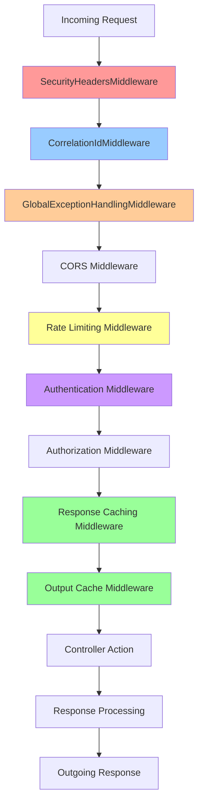

# API Middleware Architecture

## Overview

The Financial Monitoring API implements a comprehensive middleware pipeline that provides security, performance monitoring, error handling, and operational features. Each middleware component serves a specific purpose in the request/response lifecycle.

## Middleware Pipeline Flow



## Middleware Components

### 1. SecurityHeadersMiddleware
**Purpose**: Adds essential security headers to all responses

**Headers Added**:
- `X-Content-Type-Options: nosniff`
- `X-Frame-Options: DENY`
- `X-XSS-Protection: 1; mode=block`
- `Strict-Transport-Security: max-age=31536000; includeSubDomains`
- `Content-Security-Policy: default-src 'self'`
- `Referrer-Policy: strict-origin-when-cross-origin`

**Security Benefits**:
- Prevents MIME type sniffing attacks
- Blocks clickjacking attempts
- Enables XSS protection
- Enforces HTTPS connections
- Controls resource loading policies

### 2. CorrelationIdMiddleware
**Purpose**: Ensures request traceability across distributed systems

**Functionality**:
- Generates unique correlation ID for each request
- Uses existing `X-Correlation-Id` header if present
- Adds correlation ID to response headers
- Enables distributed tracing and log correlation

**Implementation**:
```csharp
public class CorrelationIdMiddleware
{
    public async Task InvokeAsync(HttpContext context)
    {
        var correlationId = context.Request.Headers["X-Correlation-Id"].FirstOrDefault() 
            ?? Guid.NewGuid().ToString();
        
        context.Response.Headers.Add("X-Correlation-Id", correlationId);
        // Continue pipeline...
    }
}
```

### 3. GlobalExceptionHandlingMiddleware
**Purpose**: Provides centralized error handling and consistent error responses

**Features**:
- Catches unhandled exceptions
- Logs errors with correlation IDs
- Returns standardized error responses
- Prevents sensitive information leakage
- Maintains API contract consistency

**Error Response Format**:
```json
{
    "success": false,
    "message": "An error occurred while processing the request",
    "correlationId": "550e8400-e29b-41d4-a716-446655440000",
    "timestamp": "2024-01-15T10:30:00.000Z"
}
```

### 4. CORS Middleware
**Purpose**: Handles Cross-Origin Resource Sharing for web applications

**Configuration**:
- Configurable allowed origins from settings
- Supports all HTTP methods and headers
- Enables credentials for authenticated requests
- Development and production origin policies

### 5. Rate Limiting Middleware (AspNetCoreRateLimit)
**Purpose**: Prevents API abuse and ensures fair resource usage

**Rate Limiting Rules**:
- General API: 1000 requests per minute
- Transaction endpoints: 100 requests per minute
- IP-based rate limiting
- Endpoint-specific limits
- Configurable time windows

**Implementation**:
```csharp
options.GeneralRules = new List<RateLimitRule>
{
    new RateLimitRule
    {
        Endpoint = "*",
        Period = "1m",
        Limit = 1000
    },
    new RateLimitRule
    {
        Endpoint = "*/transactions",
        Period = "1m", 
        Limit = 100
    }
};
```

### 6. Authentication Middleware
**Purpose**: Validates API key authentication

**Features**:
- API Key validation via `X-Api-Key` header
- Custom authentication scheme
- Secure key comparison
- Request rejection for invalid keys

### 7. Authorization Middleware
**Purpose**: Enforces access control policies

**Features**:
- Role-based access control
- Resource-level permissions
- Policy-based authorization
- Integration with authentication

### 8. Response Caching Middleware
**Purpose**: Implements server-side response caching

**Configuration**:
- 1MB maximum response size
- 10MB total cache size
- Case-insensitive path matching
- Conditional response handling

### 9. Output Cache Middleware
**Purpose**: Modern HTTP response caching with fine-grained control

**Features**:
- Policy-based caching rules
- Query parameter variation
- Route value variation
- Conditional caching based on request headers

## Middleware Execution Order

The middleware order is critical for proper functionality:

1. **Security headers** - Applied first to ensure all responses are secured
2. **Correlation ID** - Early assignment for complete request tracing
3. **Exception handling** - Catches errors from downstream middleware
4. **CORS** - Handles preflight requests before authentication
5. **Rate limiting** - Applied before expensive authentication operations
6. **Authentication** - Validates request credentials
7. **Authorization** - Enforces access policies
8. **Caching** - Optimizes response delivery

## Configuration

### Program.cs Middleware Registration
```csharp
// Middleware pipeline configuration
app.UseResponseCaching();
app.UseOutputCache();
app.UseMiddleware<SecurityHeadersMiddleware>();
app.UseMiddleware<CorrelationIdMiddleware>();
app.UseMiddleware<GlobalExceptionHandlingMiddleware>();
app.UseCors(MyAllowSpecificOrigins);
app.UseIpRateLimiting();
app.UseAuthentication();
app.UseAuthorization();
```

## Monitoring and Observability

### Logging Integration
- All middleware components integrate with ASP.NET Core logging
- Structured logging with correlation IDs
- Performance metrics collection
- Error tracking and alerting

### Application Insights Integration
- Request/response telemetry
- Dependency tracking
- Performance counters
- Custom metrics and events
- Distributed tracing support

## Best Practices

### Security
- Always place security middleware early in the pipeline
- Validate and sanitize all inputs
- Use HTTPS in production environments
- Implement proper error handling to prevent information disclosure

### Performance
- Order middleware by execution frequency and cost
- Cache frequently accessed data
- Monitor middleware performance impact
- Use async/await patterns properly

### Maintainability  
- Keep middleware focused on single responsibilities
- Use dependency injection for testability
- Implement comprehensive logging
- Document middleware behavior and dependencies

## Testing Strategy

### Unit Testing
- Test individual middleware components in isolation
- Mock dependencies and HTTP contexts
- Verify security header application
- Test error handling scenarios

### Integration Testing
- Test complete middleware pipeline
- Verify middleware interaction
- Test authentication and authorization flows
- Validate caching behavior

### Performance Testing
- Measure middleware overhead
- Test under load conditions
- Monitor memory usage
- Validate rate limiting effectiveness