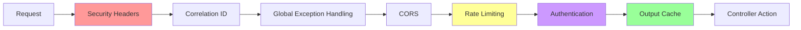

# API Middleware Pipeline

## Overview

The Financial Monitoring API uses a simple middleware pipeline for security, error handling, and performance. This is a straightforward implementation for a personal project with essential features.

## Middleware Flow



## Middleware Components

### 1. SecurityHeadersMiddleware
Adds basic security headers to all responses:
- `X-Content-Type-Options: nosniff`
- `X-Frame-Options: DENY` 
- `X-XSS-Protection: 1; mode=block`
- `Strict-Transport-Security: max-age=31536000; includeSubDomains`
- `Content-Security-Policy: default-src 'self'`

### 2. CorrelationIdMiddleware
Generates a unique ID for each request to help with logging and tracing. Uses existing `X-Correlation-Id` header if provided, otherwise creates a new GUID.

### 3. GlobalExceptionHandlingMiddleware
Catches unhandled exceptions and returns consistent error responses. Logs detailed errors internally but only returns generic messages to clients to avoid information disclosure.

### 4. CORS Middleware
Handles cross-origin requests for the Blazor frontend. Configured with allowed origins from settings.

### 5. Rate Limiting Middleware
Basic IP-based rate limiting:
- General endpoints: 1000 requests/minute
- Transaction endpoints: 100 requests/minute

### 6. Authentication Middleware
Simple API key authentication via `X-Api-Key` header. Validates against configured API key value.

### 7. Output Cache Middleware
HTTP response caching with policies:
- Transaction cache: 2 minutes (varies by query params)
- Transaction by ID: 10 minutes (varies by route)
- Anomalous transactions: 1 minute

## Configuration

The middleware is registered in `Program.cs`:

```csharp
app.UseResponseCaching();
app.UseOutputCache();
app.UseMiddleware<SecurityHeadersMiddleware>();
app.UseMiddleware<CorrelationIdMiddleware>();
app.UseMiddleware<GlobalExceptionHandlingMiddleware>();
app.UseCors(MyAllowSpecificOrigins);
app.UseIpRateLimiting();
app.UseAuthentication();
```

## Input Validation

The API uses FluentValidation for request validation:
- Page number must be > 0
- Page size between 1-100
- Date ranges must be valid
- Amount ranges must be logical

Validation errors return structured responses with correlation IDs.

## Notes

This is a straightforward middleware setup for a personal project. It covers the essential security and performance needs without over-engineering.