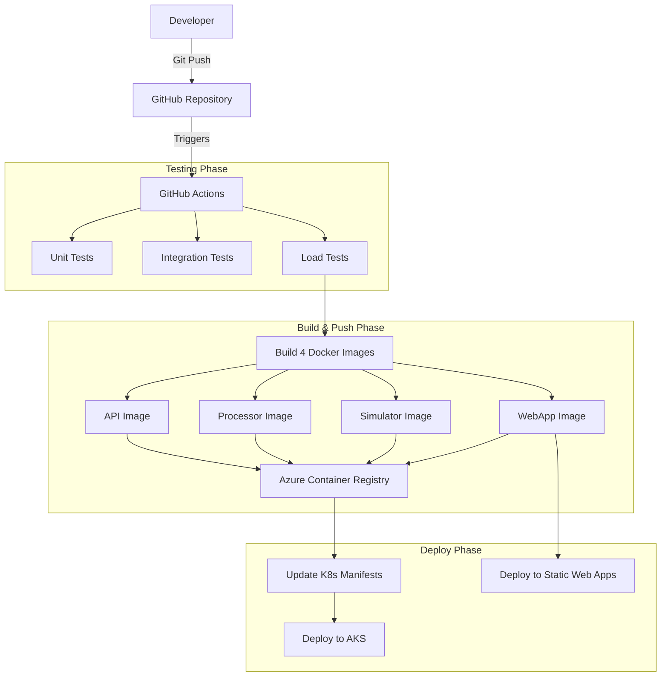

# CI/CD Pipeline Documentation

## Overview

The Real-Time Financial Monitoring System implements a comprehensive CI/CD pipeline using GitHub Actions that automatically builds, tests, and deploys the entire microservices stack to Azure. The pipeline ensures code quality through multiple testing phases.

## Pipeline Architecture

The automated deployment pipeline handles testing, building, and deployment of all components:

