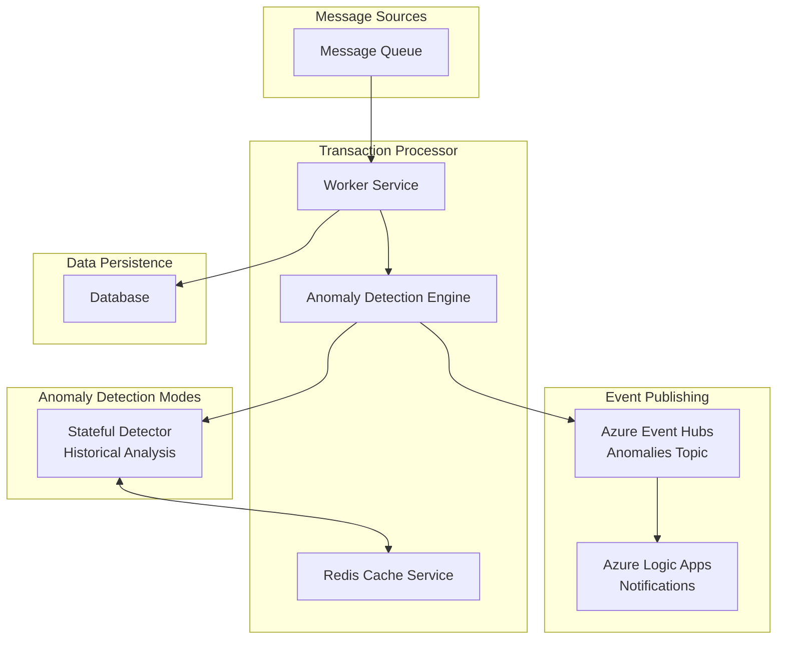

# Transaction Processor Documentation

## Overview

The Transaction Processor is the core event-driven service responsible for consuming financial transaction messages, performing real-time anomaly detection, and persisting processed transactions to the database. It acts as the intelligent processing engine in the financial monitoring pipeline, analyzing each transaction against historical patterns and business rules.

## Architecture



## Key Features

### Real-Time Transaction Processing
- **Event-Driven Architecture**: Consumes messages from Kafka (local) or Azure Event Hubs (production)
- **Asynchronous Processing**: Handles high-throughput transaction streams without blocking
- **Automatic Deserialization**: Converts JSON messages to strongly-typed Transaction objects
- **Error Handling**: Comprehensive exception handling with structured logging

### Intelligent Anomaly Detection
- **Dual Detection Modes**: Configurable stateless or stateful anomaly detection
- **Real-Time Analysis**: Immediate anomaly flagging during transaction processing
- **Event Publishing**: Automatic notification when anomalies are detected
- **Extensible Rules**: Pluggable detection algorithms for different anomaly types

### Scalable Data Persistence
- **Database Abstraction**: Repository pattern supports multiple database backends
- **Automatic Initialization**: Database and collection setup on service startup
- **Transaction Enrichment**: Adds anomaly flags before persistence
- **Performance Optimized**: Efficient data access patterns

## Core Components

### 1. Worker Service (`Worker.cs`)

The main background service that orchestrates the transaction processing pipeline:

```csharp
// Main processing loop
await _messageConsumer.ConsumeAsync(ProcessMessageAsync, stoppingToken);

// Per-message processing
Transaction kafkaTransaction = JsonSerializer.Deserialize<Transaction>(message.Value);
string anomalyFlag = await anomalyDetector.DetectAsync(kafkaTransaction);
var processedTransaction = kafkaTransaction with { AnomalyFlag = anomalyFlag };
await transactionRepository.AddTransactionAsync(processedTransaction);
```

**Key Responsibilities:**
- **Message Consumption**: Receives transactions from message brokers
- **Dependency Injection**: Creates scoped services for each transaction
- **Anomaly Detection**: Invokes appropriate detection algorithm
- **Data Persistence**: Stores enriched transactions in the database
- **Error Handling**: Logs and handles processing failures gracefully

### 2. Anomaly Detection Engine

#### Stateless Anomaly Detector (`AnomalyDetector.cs`)

Simple rule-based detection for basic scenarios:

```csharp
public async Task<string?> DetectAsync(Transaction transaction)
{
    if (transaction.Amount > _highValueThreshold) // $1000
    {
        await _eventPublisher.PublishAsync(transaction);
        return "HighValueAnomaly";
    }
    return null;
}
```

**Characteristics:**
- **Simple Rules**: Basic threshold-based detection
- **No State**: Each transaction analyzed independently
- **Fast Processing**: Minimal computational overhead
- **Deterministic**: Consistent results for same inputs

#### Stateful Anomaly Detector (`StatefulAnomalyDetector.cs`)

Advanced detection using historical account statistics:

```csharp
public async Task<string?> DetectAsync(Transaction transaction)
{
    // Retrieve account history from Redis
    var stats = await _cache.GetAsync<AccountStats>(redisKey) ?? new AccountStats();

    // Detect anomalies based on historical patterns
    if (stats.TransactionCount > MinimumTransactionCount &&
        transaction.Amount > (stats.AverageTransactionAmount * DeviationFactor))
    {
        await _eventPublisher.PublishAsync(transaction);
        return "HighValueDeviationAnomaly";
    }

    // Update running statistics
    stats.TransactionCount++;
    stats.AverageTransactionAmount += (transaction.Amount - oldAverage) / stats.TransactionCount;
    await _cache.SetAsync(redisKey, stats);

    return anomalyFlag;
}
```

**Features:**
- **Historical Context**: Uses past transactions to establish baselines
- **Account-Specific**: Maintains separate statistics per account
- **Running Averages**: Continuously updates transaction statistics
- **Deviation Analysis**: Detects amounts significantly above historical patterns
- **Redis Persistence**: Maintains state across service restarts

### Anomaly Detection Configuration

```json
{
  "AnomalyDetection": {
    "AccountStatsKeyPrefix": "account-stats:",
    "MinimumTransactionCount": 5,
    "HighValueDeviationFactor": 10.0,
    "HighValueDeviationAnomalyFlag": "HighValueDeviationAnomaly"
  }
}
```

**Settings Explained:**
- **AccountStatsKeyPrefix**: Redis key prefix for account statistics
- **MinimumTransactionCount**: Required transaction history before deviation detection
- **HighValueDeviationFactor**: Multiplier for average amount anomaly threshold
- **HighValueDeviationAnomalyFlag**: String identifier for deviation anomalies

## Deployment Architecture

### Local Development Environment

```yaml
services:
  - transaction_processor (Docker container)
  - mongodb (Docker container)
  - kafka + zookeeper (Docker containers)
  - redis (optional, for stateful detection)

configuration:
  - Environment variables via .env file
  - MongoDB connection string
  - Kafka bootstrap servers
  - Hot reload enabled for development
```

### Production Environment (Azure)

```yaml
services:
  - AKS pod with transaction processor
  - Azure Cosmos DB
  - Azure Event Hubs
  - Azure Cache for Redis
  - Azure Key Vault
  - Application Insights

security:
  - Azure AD Workload Identity
  - Key Vault secret management
  - Managed identity authentication
  - TLS encryption for all communications
```

## Monitoring and Observability

### Structured Logging

```csharp
_logger.LogInformation("Successfully processed and stored transaction {TransactionId}",
    processedTransaction.Id);

_logger.LogWarning("Stateful Anomaly Detected for transaction {TransactionId}. " +
    "Amount {Amount} is >{Factor}x the average of {Average}",
    transaction.Id, transaction.Amount, DeviationFactor, stats.AverageTransactionAmount);
```

## Data Flow and Processing Pipeline

### 1. Message Consumption
```
Event Source → Message Consumer → JSON Deserialization → Transaction Object
```

### 2. Anomaly Detection
```
Transaction → Anomaly Detector → Account History (if stateful) → Anomaly Flag
```

### 3. Event Publishing (if anomalous)
```
Anomalous Transaction → Event Publisher → Anomaly Topic → Logic Apps → Notifications
```

### 4. Data Persistence
```
Enriched Transaction → Repository → Database → Confirmation
```

### 5. Statistics Update (stateful only)
```
Transaction Data → Calculate New Average → Update Redis → Cache Confirmation
```

## Future Enhancements

### Enhanced Anomaly Detection
- **Machine Learning Models**: Integration with ML.NET or Azure ML
- **Multiple Detection Algorithms**: Pluggable detection strategies
- **Anomaly Scoring**: Confidence scores for detected anomalies
- **Dynamic Thresholds**: Self-adjusting detection parameters

### Improved Scalability
- **Event Streaming**: Integration with Apache Kafka Streams
- **Distributed Processing**: Multi-region deployment support
- **Auto-scaling**: Dynamic scaling based on message volume
- **Partitioning Strategies**: Optimized data distribution

### Advanced Monitoring
- **Predictive Analytics**: Proactive anomaly trend analysis
- **Real-time Dashboards**: Live processing visualization
- **Alert Management**: Sophisticated alerting rules
- **Performance Optimization**: Automated performance tuning
