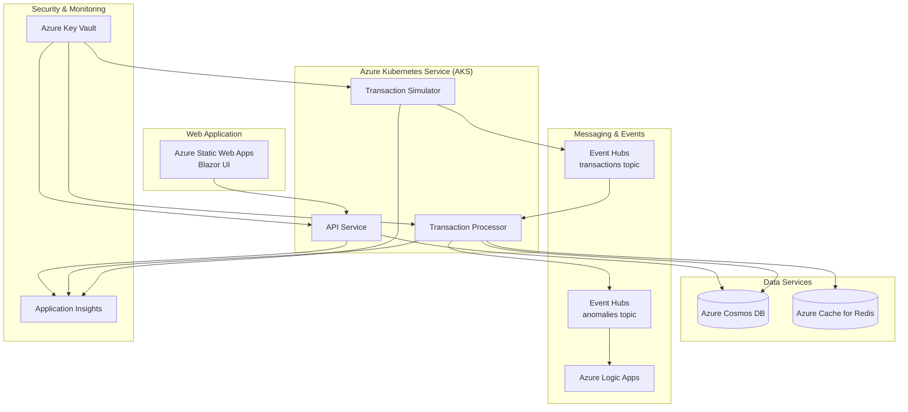

# Project Setup Documentation

## Overview

The Real-Time Financial Monitoring System can be set up in two primary ways:
1. **Local Development** using Docker Compose for quick development and testing
2. **Cloud Deployment** using Azure infrastructure with full production features

## Local Development Setup

### Prerequisites

- **Docker Desktop** (or Docker Engine + Docker Compose)
- **.NET 8 SDK**
- **Git**
- **Visual Studio Code** or **Visual Studio** (recommended)

### Quick Start - Local Development

1. **Clone the repository:**
   ```bash
   git clone <repository-url>
   cd RealTimeFinancialMonitoring
   ```

2. **Set up environment variables:**
   ```bash
   cp .env.example .env
   # Edit .env file with local configuration
   ```

3. **Start all services:**
   ```bash
   docker-compose up -d
   ```
   This starts all components:
   - **MongoDB**: `localhost:27017` - Local database (faster than Cosmos emulator)
   - **Kafka + Zookeeper**: `localhost:9092` - Event streaming
   - **API Service**: `localhost:5100` - REST API
   - **Transaction Processor**: Processes events from Kafka
   - **Transaction Simulator**: Generates test transaction data

4. **Run the Blazor Web Application (only service not in Docker):**
   ```bash
   cd src/FinancialMonitoring.WebApp
   dotnet run
   # Runs on https://localhost:7082
   ```

### Local Development Architecture

```
┌─────────────────┐    ┌──────────────────┐    ┌─────────────────┐
│   Blazor App    │───▶│   API Service    │───▶│    MongoDB      │
│  localhost:7082 │    │  localhost:5100  │    │ localhost:27017 │
│   (dotnet run)  │    │   (Docker)       │    │   (Docker)      │
└─────────────────┘    └──────────────────┘    └─────────────────┘
                                │                        ▲
                                ▼                        │
┌─────────────────┐    ┌──────────────────┐    ┌─────────────────┐
│   Simulator     │───▶│      Kafka       │───▶│   Processor     │
│   (Docker)      │    │  localhost:9092  │    │   (Docker)      │
│                 │    │   (Docker)       │    │                 │
└─────────────────┘    └──────────────────┘    └─────────────────┘
```

### Local Testing

Run the comprehensive test suite:

```bash
# Run all tests (unit + integration)
./scripts/run-tests.sh

# Or run individual test types
dotnet test tests/unit/FinancialMonitoring.Api.Tests/
dotnet test tests/integration/FinancialMonitoring.IntegrationTests/
```

---

## Cloud Deployment Setup

### Prerequisites

- **Azure Subscription** with sufficient credits/billing setup
- **Azure CLI** installed and configured (`az login`)
- **Terraform CLI** (v1.0+)
- **kubectl** for Kubernetes management
- **Docker Desktop** (for building container images)
- **Domain Name** (optional, for custom DNS)

### Environment Variables Setup

1. **Copy and configure environment:**
   ```bash
   cp .env.example .env
   # Edit .env with your specific values:
   # - AZURE_SUBSCRIPTION_ID: Your Azure subscription ID
   # - AZURE_LOCATION: Azure region (e.g., "eastus", "westus2")
   # - RESOURCE_GROUP_NAME: Name for your resource group
   # - API_KEY: Secure API key for authentication
   ```

### Automated Cloud Deployment

The system provides a comprehensive Makefile-based deployment workflow:

#### Option 1: Complete Automated Deployment

```bash
# Deploy everything from scratch
make deploy
```

This orchestrates the entire process through three phases: infrastructure, applications, and frontend.

#### Option 2: Step-by-Step Deployment

**Phase 1: Infrastructure Setup**
```bash
# Setup Azure foundation and Terraform state
make bootstrap

# Deploy core Azure infrastructure (requires manual Terraform steps)
make infra
# Follow the displayed instructions to run Terraform commands

# Continue with application configuration
make terraform-continue
```

**Phase 2: Application Deployment**
```bash
# Build containers and setup Kubernetes
make apps
# Update DNS as instructed, then continue

# Complete application deployment
make apps-continue
```

**Phase 3: Frontend Deployment**
```bash
# Deploy Blazor frontend and configure CORS
make frontend
```

### Cloud Infrastructure Components

The cloud deployment provisions:

#### Azure Kubernetes Service (AKS)
- **Auto-scaling cluster** with node auto-scaling
- **NGINX Ingress Controller** for load balancing
- **cert-manager** for automatic SSL certificates
- **Azure Workload Identity** for secure pod authentication

#### Data & Messaging Services
- **Azure Cosmos DB** (SQL API) for transaction storage
- **Azure Cache for Redis** for caching and session storage
- **Azure Event Hubs** for real-time event streaming
- **Azure Logic Apps** for serverless notifications

#### Security & Monitoring
- **Azure Key Vault** for secure secret management
- **Application Insights** for monitoring and observability
- **Azure Active Directory** for workload identity
- **API Key authentication** for API security

#### Frontend & Networking
- **Azure Static Web Apps** for Blazor WebAssembly hosting
- **Azure Container Registry** for container image storage
- **Custom domain support** with SSL certificates
- **CORS configuration** for cross-origin requests

### Cloud Deployment Architecture



### Individual Deployment Commands

For granular control or troubleshooting:

```bash
# Infrastructure only
make bootstrap          # Setup Azure foundation
make terraform-continue # Configure application secrets

# Applications only
make build-push        # Build and push container images
make k8s-setup         # Setup Kubernetes infrastructure
make apps-continue     # Continue after DNS update

# Frontend only
make deploy-blazor     # Deploy Blazor to Static Web Apps
make update-cors       # Update CORS configuration

# Monitoring and troubleshooting
make status           # Show deployment status
make logs            # Show application logs
make test            # Test deployment endpoints
```

### Cost Management

The cloud deployment includes cost optimization features:

```bash
# Stop cluster to save costs (maintains data)
make clean

# Start cluster when needed
make start

# Scale for demo purposes (2 nodes)
make demo

# Development environment
make dev
```

### DNS Configuration

For production deployments with custom domains:

1. **Purchase domain** from registrar (GoDaddy, Namecheap, etc.)
2. **Update DNS A record:**
   - Domain: `api.yourdomain.com`
   - Points to: LoadBalancer IP (shown during deployment)
3. **Wait for DNS propagation** (2-5 minutes)
4. **Continue deployment** with `make apps-continue`

---
